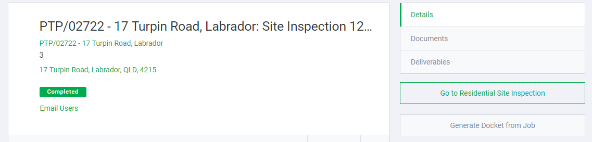

### New

- Add in a link to 'Standard' jobs from the job dashboard.

- When filling out a timesheet, if the amount of time is greater than 5 hours, it will automatically change the unpaid break field to 0.5 hours (you can undo it yourself).

### Improvements

- When adding a new notice, the noticeboard will now add the notice onto the noticeboard without you having to refresh the page.
- When deleting a notice, the noticeboard will delete the notice from the noticeboard without having to refresh the page.
- Add a show/hide Gantt chart button in the job page in the project dashboard so that you can get rid of it if you do not need it.
